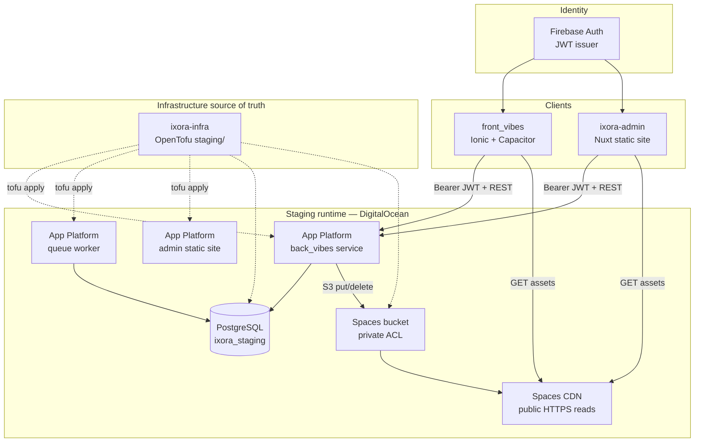
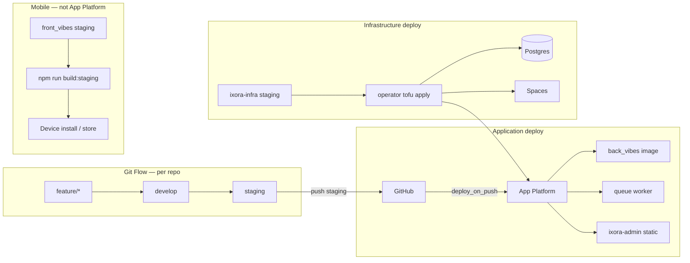
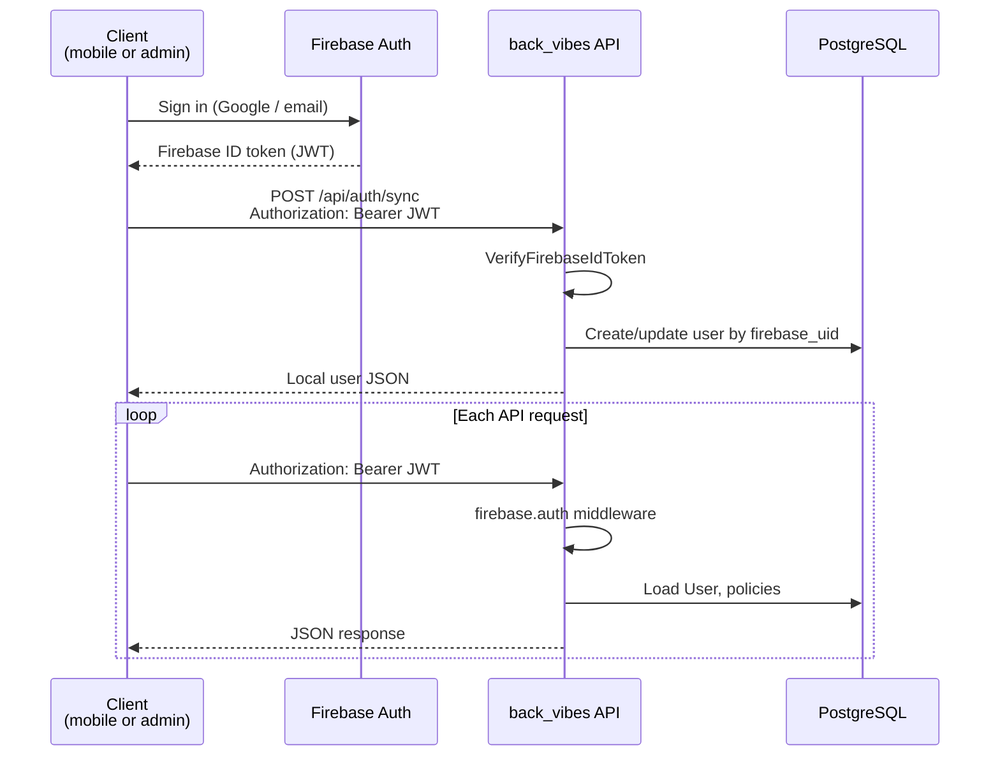
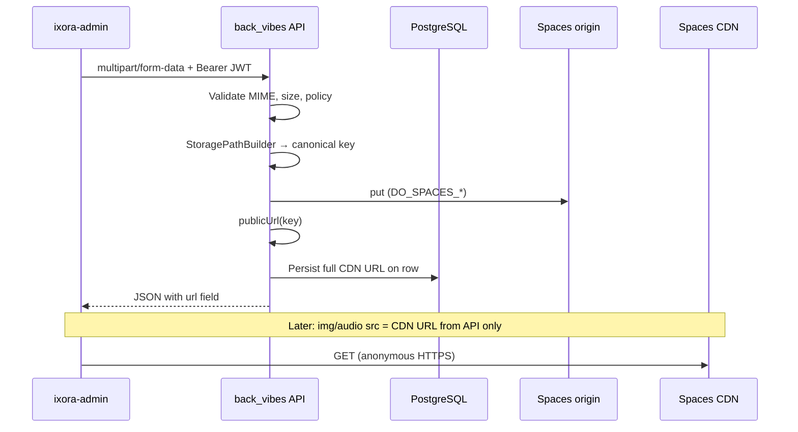
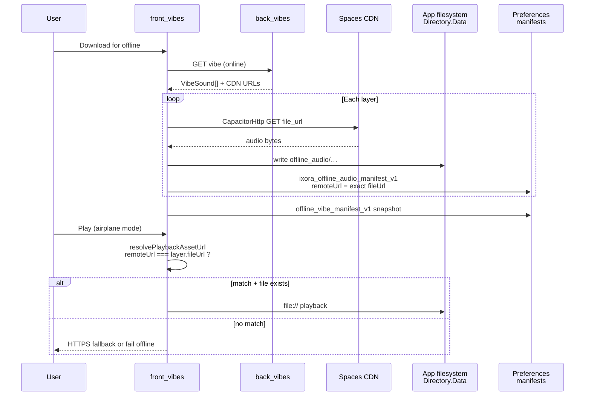

# Platform architecture map

**Status:** Active navigation document (high level)  
**Scope:** Whole Ixora ecosystem — clients, API, data, CDN, identity, infra, mobile runtime  
**Applies to:** All repositories; use this page to orient before reading specs or ADRs

> **Navigation only.** This map explains **who owns what** and **how major flows connect**. Implementation detail lives in linked architecture docs, specs, and ADRs — not here.

**Documentation index:** [`../README.md`](../README.md)

---

## Purpose

Provide a **single aerial view** of the Ixora platform: four code repositories, managed data stores, Firebase identity, DigitalOcean staging footprint, and mobile playback/offline boundaries — so engineers, reviewers, and AI tooling can route questions to the right document without reading the entire tree.

---

## Platform at a glance



**Staging reference hostnames:** API `staging-api.ixora-app.app` · Admin `staging-admin.ixora-app.app` · CDN `*.tor1.cdn.digitaloceanspaces.com`

---

## Component responsibilities

| Component | Repository / service | Primary responsibility | Does **not** do |
| --- | --- | --- | --- |
| **`front_vibes`** | Mobile app repo | Browse/play vibes, **execution plan**, **playback runtime**, **offline download**, user vibe CRUD via API | Spaces writes, catalog sound create, server-side play |
| **`ixora-admin`** | Admin repo | Catalog UI (sounds, covers, presets), multipart **upload via API**, static admin site | Business rules, Spaces credentials, JWT verification logic |
| **`back_vibes`** | Laravel API repo | Domain model, policies, **Firebase JWT verify**, **Spaces I/O**, REST JSON, **queue jobs** | Mobile/admin UI, IaC, CDN edge config |
| **`ixora-infra`** | Infra + docs repo | **OpenTofu** staging stack, central specs/architecture/ADRs, Git Flow standard | Application runtime code |
| **PostgreSQL** | Managed DB (DO) | System of record: users, vibes, sounds, URLs, jobs table | Asset bytes, identity provider |
| **Spaces CDN** | DigitalOcean | Public **HTTPS** delivery of object bytes; URLs persisted on rows | Auth on GET; client uploads |
| **Firebase Auth** | Google Firebase | Sign-in (Google, email/password), **ID token (JWT)** issuance | Vibes, sounds, uploads, playback |
| **OpenTofu** | `opentofu/staging/` | Declarative VPC, Postgres, bucket, App Platform apps, env injection | App deploy on git push (App Platform handles that) |
| **App Platform** | DigitalOcean | Run API container, **queue worker**, Nuxt static site; TLS, build on `staging` push | Laravel migrations (manual ops) |
| **Playback runtime** | `front_vibes` (Pinia + services) | Orchestrate layers, native audio, UI state, foreground service | Build plan from API pivot data only; no server tick |
| **Execution plan** | `front_vibes` (`buildVibeExecutionPlan`) | Pure transform **`VibeSound[]` → `VibeExecutionLayer[]`** | Load bytes, enqueue server jobs, apply fades |
| **Offline storage** | `front_vibes` (Preferences + Filesystem) | Explicit download, manifests, **`file://`** resolve when URL matches | Auto-sync on play; ExoPlayer cache as guarantee |
| **Queue worker** | App Platform worker (`queue:work --queue=push,smart-home,default`) | Drain Laravel **database** queue (mail, push, Smart Home jobs) | HTTP API, playback, Spaces policy |

---

## Ownership boundaries

```
┌────────────────────────────────────────────────────────────────────────────┐
│                         TRUST & WRITE BOUNDARIES                            │
├──────────────────────────┬─────────────────────────────────────────────────┤
│ Identity (who signed in) │ Firebase Auth                                    │
│ Authorization (what OK)  │ back_vibes — policies, middleware, ownership     │
│ Relational truth         │ PostgreSQL                                       │
│ Object bytes             │ Spaces (origin) — write/delete: Laravel ONLY     │
│ Public asset URLs        │ CDN hostname — Laravel publicUrl() → DB columns   │
│ Client-visible config    │ BUILD_TIME (admin) / compile-time (mobile)       │
│ Server runtime config    │ OpenTofu → App Platform RUN_TIME env             │
│ Playback timing          │ front_vibes — execution plan + player (device)   │
│ Offline bytes            │ front_vibes — app-private Directory.Data         │
│ Infra shape              │ ixora-infra OpenTofu (not hand-edited drift)     │
└──────────────────────────┴─────────────────────────────────────────────────┘
```

| Boundary rule | Detail |
| --- | --- |
| **Clients never hold `DO_SPACES_*`** | [ADR-002](../decisions/ADR-002-laravel-only-storage-writes.md) · [ADR-006](../decisions/ADR-006-no-direct-mobile-uploads.md) |
| **Clients never trust body fields for identity** | JWT claims only after Laravel verify — [ADR-001](../decisions/ADR-001-firebase-auth-laravel-sync.md) |
| **API does not execute vibes** | No play endpoint, no scheduler — [playback-runtime](audio/playback-runtime.md) |
| **Preset imports are copies** | No live sync to user vibes — [ADR-003](../decisions/ADR-003-preset-import-independent-vibes.md) · [ADR-005](../decisions/ADR-005-no-realtime-preset-sync.md) |
| **Offline is explicit** | User action + manifests — [ADR-004](../decisions/ADR-004-offline-audio-strategy.md) |

---

## Runtime interactions

### Request paths (online)

```
                    ┌──────────────┐
                    │ Firebase Auth │
                    └───────┬──────┘
                            │ ID token
         ┌──────────────────┼──────────────────┐
         ▼                  ▼                  ▼
   front_vibes         ixora-admin         (no direct
         │                  │               client→DB)
         │  Authorization: Bearer JWT
         └────────────┬─────┘
                      ▼
              back_vibes (api service)
                      │
         ┌────────────┼────────────┐
         ▼            ▼            ▼
    PostgreSQL    Spaces SDK    queue table
    (read/write)  (put/delete)   → queue worker
                      │
                      ▼
                 Spaces CDN ◄──── GET (admin/mobile, no auth on asset URL)
```

| Interaction | Pattern |
| --- | --- |
| **API mutations** | HTTPS JSON + Firebase Bearer; Laravel validates, persists Postgres, may enqueue job |
| **API reads** | JSON includes **full CDN URL strings**; clients use URLs opaquely |
| **Asset GET** | Direct HTTPS to CDN; separate from API auth |
| **Queue** | API dispatches to `jobs` table; **worker** same image/env as API — [staging-digitalocean](backend/staging-digitalocean.md) |
| **Admin → API CORS** | Explicit allowlist on API — admin origin + localhost dev |

### Mobile-only runtime (device)

```
GET /api/vibes/{id}  →  VibeSound[]
         │
         ▼
 buildVibeExecutionPlan()     ← execution plan (pure, client)
         │
         ▼
 player.store / audio-player  ← playback runtime
         │
         ├── NativeAudio / ExoPlayer  (HTTPS CDN stream)
         └── optional file://       (offline manifest match)
```

Deep dive: [execution-plan spec](../specs/vibes/execution-plan/spec.md) · [playback-runtime](audio/playback-runtime.md) · [ADR-007](../decisions/ADR-007-execution-plan-runtime-contract.md)

---

## Deployment boundaries

Three **independent** delivery mechanisms — coordinate on **`staging`** branch, not one monolithic pipeline.



| Artifact | Trigger | Host |
| --- | --- | --- |
| **Laravel API + worker** | Push `back_vibes` **`staging`** | App Platform Docker |
| **Admin static site** | Push `ixora-admin` **`staging`** | App Platform `npm run generate` |
| **Infra + env vars** | Manual **`tofu apply`** after `ixora-infra` merge | DigitalOcean resources |
| **Mobile binary** | Manual/CI **`build:staging`** | User device — not hosted on DO |

Runbook: [deploy-pipeline](backend/deploy-pipeline.md) · [staging-digitalocean](backend/staging-digitalocean.md) · [Git Flow](../standards/git-flow.md)

---

## Auth flow

Identity in **Firebase**; business user in **PostgreSQL**; every API call re-verifies JWT.



| Step | Owner |
| --- | --- |
| Sign-in UI & token refresh | Client Firebase SDK |
| Token cryptography & `users` row | **back_vibes** |
| Admin write gate | **`admin.approved`** middleware (additional) |

Detail: [ADR-001](../decisions/ADR-001-firebase-auth-laravel-sync.md) · [front-vibes-auth-core](../standards/front-vibes-auth-core.md)

---

## Upload flow

**All bytes to Spaces pass through Laravel.** Admin uses multipart; mobile does **not** upload catalog assets today.



| Actor | Upload capability |
| --- | --- |
| **ixora-admin** | Sounds, cover bundles, generic admin upload routes |
| **front_vibes** | **Read-only** CDN URLs — [ADR-006](../decisions/ADR-006-no-direct-mobile-uploads.md) |
| **back_vibes** | Sole Spaces writer — [ADR-002](../decisions/ADR-002-laravel-only-storage-writes.md) |

Detail: [storage-strategy](storage/storage-strategy.md) · [spaces-cdn-policy](storage/spaces-cdn-policy.md) · [upload-validation](../standards/upload-validation.md)

---

## Playback flow

**Server stores configuration; device executes playback.** No backend audio engine.

```mermaid
flowchart TD
  A[User taps Play] --> B[Load vibe + vibe_sounds from API<br/>or offline snapshot]
  B --> C[buildVibeExecutionPlan]
  C --> D[VibeExecutionLayer[]]
  D --> E[player.store / audio-player.service]
  E --> F{URL resolve}
  F -->|offline manifest match| G[file:// local path]
  F -->|else| H[HTTPS CDN stream]
  G --> I[NativeAudio / ExoPlayer]
  H --> I
  I --> J[UI: MiniPlayer, timers, FGS on Android]
```

| Layer | Responsibility |
| --- | --- |
| **`vibe_sounds` (API)** | Pivot: sound_id, volume, play_mode, timing, sort_order |
| **Execution plan** | Deterministic layer list + `fileUrl` from catalog sound |
| **Playback runtime** | Schedules loop/once/interval; native audio; **ignores fade fields** — [ADR-008](../decisions/ADR-008-nativeaudio-limitations-over-unstable-dsp.md) |

Detail: [execution-plan spec](../specs/vibes/execution-plan/spec.md) · [playback-runtime spec](../specs/vibes/playback-runtime/spec.md) · [playback-runtime architecture](audio/playback-runtime.md)

---

## Offline flow

**Guaranteed offline ≠ streaming cache.** User explicitly downloads; manifests tie bytes to exact CDN URL strings.



| Mechanism | Guarantee |
| --- | --- |
| **ExoPlayer SimpleCache** | Best-effort streaming only — not offline contract |
| **CapacitorHttp + Filesystem + manifests** | Full-file offline — [ADR-004](../decisions/ADR-004-offline-audio-strategy.md) |
| **URL change on server** | Offline invalid until user re-downloads — [spaces-cdn-policy](storage/spaces-cdn-policy.md) |

Detail: [offline-download spec](../specs/vibes/offline-download/spec.md) · [audio-cache](audio/audio-cache.md)

---

## Data & infrastructure map

```
┌─────────────────────────────────────────────────────────────────┐
│ ixora-infra (OpenTofu)                                            │
│  vpc.tf · database.tf · spaces.tf · app-api.tf · app-admin.tf     │
└────────────────────────────┬────────────────────────────────────┘
                             │ provisions
                             ▼
┌─────────────────────────────────────────────────────────────────┐
│ DigitalOcean staging (tor1 / tor)                                │
│                                                                  │
│  PostgreSQL ──private──► App: ixora-api-staging                  │
│       │                      ├── service: api (FrankenPHP)       │
│       │                      └── worker: queue (queue:work)      │
│       │                                                          │
│  Spaces bucket ──CDN──► public asset URLs in PostgreSQL rows      │
│                                                                  │
│  App: ixora-admin-staging (static Nuxt — no VPC)                 │
└─────────────────────────────────────────────────────────────────┘

front_vibes ──HTTPS──► API + CDN   (not on App Platform)
```

| Store | Contents |
| --- | --- |
| **PostgreSQL** | Users, vibes, sounds, cover bundles, presets, pivots, **`jobs`** queue |
| **Spaces** | Audio/image bytes at canonical keys |
| **CDN** | Same objects, cache-friendly HTTPS host for clients |
| **Device** | Offline audio files + Preferences manifests |

---

## Queue worker in the platform

The worker is **not** part of playback or upload hot paths — it drains async Laravel jobs.

```
HTTP request (api service)
    │  e.g. AdminAccessRequestedMail implements ShouldQueue
    ▼
jobs table (PostgreSQL)
    ▼
queue worker — php artisan queue:work --queue=push,smart-home,default
    │  same RUN_TIME env as API (DB, mail, FIREBASE_*, PUSH_PROVIDER=fcm)
    ▼
external side effect (e.g. SMTP)
```

Same git deploy updates **both** API and worker. Detail: [staging-digitalocean — queue](backend/staging-digitalocean.md#queue--runtime-relationship)

---

## What this map intentionally omits

| Topic | Where to read |
| --- | --- |
| Endpoint-level API contracts | [`../specs/`](../README.md#1-specs) |
| Form validation rules | [upload-validation](../standards/upload-validation.md) |
| Future scheduler / transcoding | [scheduling-model](backend/scheduling-model.md) · [future-processing-pipeline](storage/future-processing-pipeline.md) (*planning*) |
| Production topology | Not documented in this staging-focused tree |
| Kubernetes / multi-region / signed CDN URLs | **Not used** |

---

## Related documentation

| Topic | Document |
| --- | --- |
| **Full doc index** | [../README.md](../README.md) |
| **Staging topology** | [backend/staging-digitalocean.md](backend/staging-digitalocean.md) |
| **Deploy pipeline** | [backend/deploy-pipeline.md](backend/deploy-pipeline.md) |
| **Storage & CDN policy** | [storage/storage-strategy.md](storage/storage-strategy.md) · [storage/spaces-cdn-policy.md](storage/spaces-cdn-policy.md) |
| **Mobile asset QA** | [storage/mobile-cdn-validation.md](storage/mobile-cdn-validation.md) |
| **All ADRs** | [../decisions/](../README.md#4-architecture-decision-records-adrs) |

When platform boundaries change, update **this map first**, then sync [../README.md](../README.md) and affected ADRs.
