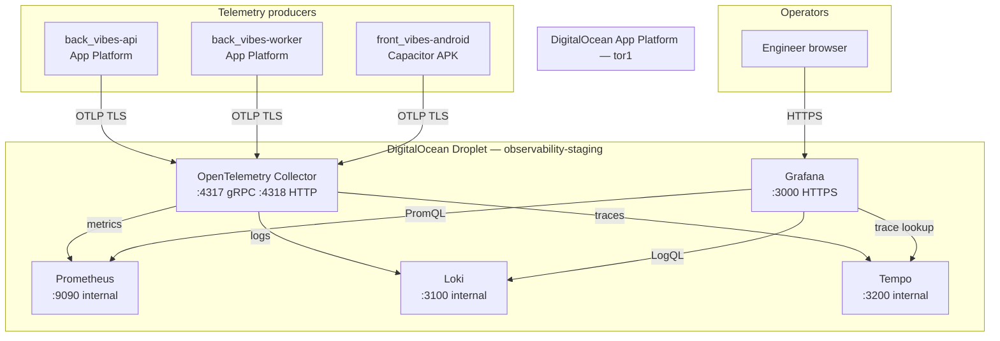

# Observability Foundation — Infrastructure Review

**Status:** Phase 2 complete — documentation only  
**Spec:** [`spec.md`](spec.md) · **Plan:** [`plan.md`](plan.md) · **Tasks:** [`tasks.md`](tasks.md)  
**ADRs:** [ADR-028](../../../decisions/ADR-028-observability-platform.md) · [ADR-029](../../../decisions/ADR-029-telemetry-data-model.md) · [ADR-030](../../../decisions/ADR-030-observability-security-and-privacy.md) · [ADR-031](../../../decisions/ADR-031-retention-storage-and-cost-control.md)  
**Applies to:** Staging MVP observability VM — **review only**; no resources deployed in this phase

> **Rule of thumb:** This document validates **where** and **how** the observability stack will run before Phase 3 creates any infrastructure. Implementation begins in **Phase 3 — Collector Deployment**.

---

## 1. Deployment topology

### Initial deployment (MVP)

All observability components run on a **single DigitalOcean Droplet** in the **Toronto (`tor1`)** region — aligned with existing staging App Platform footprint ([staging-digitalocean.md](../../../architecture/backend/staging-digitalocean.md)).

```
DigitalOcean Droplet (observability-staging)
├── OpenTelemetry Collector   ← sole external ingest (OTLP)
├── Prometheus                ← metrics TSDB
├── Loki                      ← log chunks + index
├── Tempo                     ← trace blocks
└── Grafana                   ← visualization (reads backends only)
```

**Separate from App Platform:** The Laravel API, queue worker, and scheduler remain on **App Platform**. The observability VM is a **dedicated telemetry host** — not co-located with application containers.

### Why single-VM co-location (MVP)

| Factor | Rationale |
| --- | --- |
| **Cost** | One Droplet + block storage vs four managed services |
| **Operational surface** | One SSH target, one firewall policy, one backup scope for MVP homologation |
| **Latency** | Collector → backends on localhost avoids cross-VM fan-out during early staging |
| **Scope control** | Matches [ADR-028](../../../decisions/ADR-028-observability-platform.md) MVP non-goals (no HA, no multi-region) |
| **Staging first** | Homologation traffic is bounded; single VM sufficient for validation |

### External clients

| Client | Location | Connects to |
| --- | --- | --- |
| `back_vibes-api` | App Platform service | Collector OTLP (HTTPS) |
| `back_vibes-worker` | App Platform queue + scheduler | Collector OTLP (HTTPS) |
| `front_vibes-android` | User devices (staging APK) | Collector OTLP (HTTPS) |
| Engineers | Browser / VPN | Grafana HTTPS only |

Apps **never** connect to Prometheus, Loki, or Tempo directly ([ADR-028](../../../decisions/ADR-028-observability-platform.md)).

### Expected evolution (post-MVP)

| Stage | Topology |
| --- | --- |
| **MVP (Phase 3–9)** | Single VM — all components co-located |
| **Growth** | Dedicated Collector VM; storage backends on separate Droplets or managed services |
| **HA (explicitly deferred)** | Collector behind load balancer; replicated Grafana; distributed Loki/Tempo |
| **Multi-region** | Regional Collectors; centralized long-term store — requires new ADR |

See §9 for scaling path. **No implementation in Phase 2.**

---

## 2. Component responsibilities

Clear ownership prevents overlap between infra, Collector config, app SDKs, and dashboards.

| Component | Owns | Does not own |
| --- | --- | --- |
| **OpenTelemetry Collector** | OTLP ingest; processors (redaction, sampling, batching); routing to Prometheus/Loki/Tempo; health endpoint | Business logic; long-term query UI; app instrumentation |
| **Prometheus** | Metrics TSDB; scrape/remote-write storage; PromQL; retention enforcement (30 d) | Logs; traces; raw OTLP from apps |
| **Loki** | Log chunk storage; log index; LogQL; retention (14 d) | Metrics; traces; Laravel `Log::` formatting in apps |
| **Tempo** | Trace block storage; trace ID lookup; retention (7 d); head sampling cooperation | Metrics; log storage; span creation in apps |
| **Grafana** | Dashboards; Explore; datasource queries; authenticated UI | Telemetry ingest; Collector config; product DB queries |

### Boundary rules

| Layer | Responsibility |
| --- | --- |
| **Applications (`back_vibes`, `front_vibes`)** | OTel SDK init; export OTLP to Collector; inject `trace_id` into logs |
| **Collector** | Enforce ADR-030 redaction, ADR-031 sampling/cardinality before storage |
| **Backends (Prometheus, Loki, Tempo)** | Durable storage within retention windows |
| **Grafana** | Read-only visualization — no write path to apps |
| **Infrastructure (Phase 3+)** | VM provisioning, firewall, TLS certs, disk, process supervision — **not in Phase 2** |

---

## 3. Data flow

### Backend telemetry flow

```
back_vibes (API + queue + scheduler)
    │  OTel SDK: traces, metrics, logs (OTLP)
    │  HTTP/gRPC → Collector endpoint only
    ▼
OpenTelemetry Collector
    │  processors: batch, redact, sample, attributes
    ├── metrics  ──► Prometheus (remote write or Prometheus exporter scrape)
    ├── logs     ──► Loki (push API)
    └── traces   ──► Tempo (OTLP or native exporter)
    ▼
Grafana
    ├── Prometheus datasource → metrics panels
    ├── Loki datasource       → log panels / Explore
    └── Tempo datasource      → trace panels / Explore (linked to Loki via trace_id)
```

**Correlation path:** Laravel log with `trace_id` → Loki → Grafana Explore → Tempo trace → child spans.

### Mobile telemetry flow

```
front_vibes-android (Capacitor)
    │  OTel SDK: traces, logs (metrics optional, low volume)
    │  OTLP/HTTP → Collector (same endpoint, different service.name)
    ▼
OpenTelemetry Collector
    ├── logs   ──► Loki
    └── traces ──► Tempo
    (metrics optional → Prometheus if enabled)

Grafana → Tempo / Loki (service.name = front_vibes-android)
```

Mobile uses **conservative sampling** (5% success, 100% errors) per [ADR-031](../../../decisions/ADR-031-retention-storage-and-cost-control.md). Cellular payload size must stay small — batch export preferred.

### What does not flow

| Forbidden path | Reason |
| --- | --- |
| App → Prometheus | Bypasses Collector processors |
| App → Loki push | Bypasses redaction |
| App → Tempo direct | Bypasses sampling policy |
| Grafana → Postgres / Firebase | Observability reads telemetry backends only |
| Collector → App Platform | No reverse control plane in MVP |

---

## 4. Communication matrix

| Source | Destination | Protocol | Direction | Purpose |
| --- | --- | --- | --- | --- |
| `back_vibes-api` | Collector | OTLP/gRPC or OTLP/HTTP | Outbound from App Platform | Traces, metrics, logs |
| `back_vibes-worker` | Collector | OTLP/gRPC or OTLP/HTTP | Outbound | Worker traces, metrics, logs |
| `front_vibes-android` | Collector | OTLP/HTTP (TLS) | Outbound from device | Mobile traces, logs |
| Collector | Prometheus | Remote write or `/metrics` scrape | Localhost | Export processed metrics |
| Collector | Loki | Loki push API (HTTP) | Localhost | Export processed logs |
| Collector | Tempo | OTLP or Tempo ingest HTTP | Localhost | Export sampled traces |
| Grafana | Prometheus | PromQL HTTP | Localhost (or internal) | Dashboard queries |
| Grafana | Loki | LogQL HTTP | Localhost | Log search |
| Grafana | Tempo | Tempo query API | Localhost | Trace lookup |
| Engineer browser | Grafana | HTTPS | Inbound to VM | UI access |
| Engineer browser | Collector | — | **Blocked** | No direct Collector UI in MVP |
| Prometheus | Collector | — | **None** | Prometheus does not call Collector |
| App Platform | Observability VM | TLS (OTLP 4317/4318) | Egress from DO | Telemetry ingest |
| Mobile networks | Observability VM | TLS (OTLP 4318) | Internet → VM | Staging APK telemetry |

**Internal-only:** Prometheus, Loki, Tempo, and Grafana backend ports bind to **localhost** or private interface — not public internet.

---

## 5. Ports

### Required ports (MVP)

| Port | Protocol | Service | Exposure | Notes |
| --- | --- | --- | --- | --- |
| **4317** | gRPC | Collector OTLP | **Public (TLS)** | Primary for backend workers |
| **4318** | HTTP | Collector OTLP | **Public (TLS)** | Mobile + HTTP fallback |
| **8888** | HTTP | Collector metrics (self) | Internal | Collector self-monitoring |
| **13133** | HTTP | Collector health | Internal / ops | Health checks |
| **9090** | HTTP | Prometheus | **Internal only** | TSDB + PromQL |
| **3100** | HTTP | Loki | **Internal only** | Push + query |
| **3200** | HTTP | Tempo | **Internal only** | Query + optional ingest |
| **3000** | HTTP | Grafana | **Public (TLS + auth)** | Engineer UI |

Optional: **9091** Prometheus `--web.enable-lifecycle` — internal only if enabled.

### Firewall policy (architectural intent)

| Rule | Detail |
| --- | --- |
| **Allow inbound 4317, 4318** | From App Platform egress IPs + staging mobile (TLS + API key — Phase 2.5) |
| **Allow inbound 443/3000** | Grafana HTTPS for authenticated engineers |
| **Deny inbound 9090, 3100, 3200** | Backends never public |
| **Allow outbound** | Collector → localhost backends; VM package updates |
| **SSH (22)** | Restrict to operator IPs only — not open to `0.0.0.0/0` |

Exact IP allowlists documented in **Phase 2.5 Security Review**. DNS/TLS strategy: **`otel-staging.ixora-app.app`** (Collector) and **`grafana-staging.ixora-app.app`** (Grafana) — hostnames reserved; certificates in Phase 3.

---

## 6. Storage review

Reference: [ADR-031](../../../decisions/ADR-031-retention-storage-and-cost-control.md).

### Retention windows (staging MVP)

| Signal | Retention | Storage component |
| --- | --- | --- |
| Metrics | **30 days** | Prometheus TSDB (`/prometheus/data`) |
| Logs | **14 days** | Loki chunks + boltdb/TSDB index |
| Traces | **7 days** | Tempo blocks |

### Disk budget (single VM)

| Allocation | Target share | Notes |
| --- | --- | --- |
| **Total block storage** | 80–160 GB (final size in Phase 3 provisioning) | Alert at 70%; never sustain > 85% |
| **Prometheus TSDB** | ≤ 40% | High churn; compaction daily |
| **Loki** | ≤ 35% | JSON logs compress well |
| **Tempo** | ≤ 25% | Highest volume; shortest retention |
| **OS + Collector buffers** | Headroom in remaining space | WAL, queue spikes |

### Growth drivers

| Driver | Affects | Mitigation |
| --- | --- | --- |
| HTTP request rate | Metrics histograms, trace volume | Sampling; route templates not raw URLs |
| Worker job volume | Traces, logs | 100% error traces; 10% success ([ADR-031](../../../decisions/ADR-031-retention-storage-and-cost-control.md)) |
| Verbose Laravel logs | Loki | Structured logs; no debug spam in staging |
| Mobile sessions | Tempo, Loki | 5% mobile trace sampling |
| Cardinality explosion | Prometheus | Label allowlist at Collector |

### Temporary / buffer storage

| Component | Temporary data | Risk if unbounded |
| --- | --- | --- |
| **Collector** | Export queue, batch buffers | Memory pressure; export lag |
| **Prometheus** | WAL before compaction | Disk spike during restarts |
| **Loki** | Ingester memory, chunk flush | OOM if ingest rate spikes |
| **Tempo** | Block buffer before flush | Disk spike during trace bursts |

**Policy:** Reduce sampling/retention before expanding disk ([ADR-031](../../../decisions/ADR-031-retention-storage-and-cost-control.md)).

### Estimated staging growth (order of magnitude)

| Signal | Expected daily (staging homologation) | Notes |
| --- | --- | --- |
| Metrics | Low hundreds of MB/month TSDB | Bounded by label allowlist |
| Logs | 1–5 GB/month compressed | Depends on log verbosity |
| Traces | 2–10 GB/month | Dominated by sampling rate |

Exact sizing validated after Phase 7/8 SDK integration — this review sets **architectural budgets**, not production SLAs.

---

## 7. Stateful vs stateless

| Component | Stateful? | Persistent data | Backup implication |
| --- | --- | --- | --- |
| **Collector** | **Mostly stateless** | Optional file queue (if configured) | Redeploy from config; no TSDB backup |
| **Prometheus** | **Stateful** | TSDB blocks on disk | Snapshot or volume backup; 30 d max value |
| **Loki** | **Stateful** | Chunks + index | Volume backup; 14 d max value |
| **Tempo** | **Stateful** | Trace blocks | Volume backup; 7 d max value |
| **Grafana** | **Semi-stateful** | SQLite or Postgres for dashboards/users | Export dashboards as JSON; user DB backup |

### Backup strategy (architectural)

| Priority | Action |
| --- | --- |
| **Dashboards** | Version control JSON in repo (Phase 9) — source of truth |
| **Telemetry data** | **Not archived long-term in MVP** — acceptable loss within retention window |
| **VM snapshot** | Optional weekly Droplet snapshot for disaster recovery — Phase 10 runbook |
| **Collector config** | Git-managed in `ixora-infra` (Phase 3+) — not hand-edited on VM only |

**Failure acceptance:** Losing > 7 days of traces is acceptable per ADR-031; business data lives in Postgres on App Platform, not on observability VM.

---

## 8. Failure analysis

Telemetry failure must **never** break product behaviour ([ADR-028](../../../decisions/ADR-028-observability-platform.md), [ADR-029](../../../decisions/ADR-029-telemetry-data-model.md)).

| Failure | Product impact | Observability impact | Expected behaviour |
| --- | --- | --- | --- |
| **Collector unavailable** | **None** — apps continue | Telemetry gap; export errors logged locally | Apps best-effort drop OTLP; `ixora.telemetry.export.failed.total` rises when instrumented |
| **Grafana unavailable** | **None** | Cannot view dashboards | Backends still ingest; fix Grafana process |
| **Prometheus unavailable** | **None** | Metrics gap | Collector buffers briefly then drops metrics export; alerts fire (post-MVP) |
| **Loki unavailable** | **None** | Log search gap | App Platform runtime logs still available as fallback |
| **Tempo unavailable** | **None** | Trace search gap | Loki `trace_id` correlation unavailable until restored |
| **Disk full** | **None** if VM isolated | **All backends may crash** | Oldest data deleted per retention; emergency ops in [observability-playbook.md](../../../operations/observability-playbook.md) |
| **Network interruption** (App → Collector) | **None** | Telemetry gap during outage | SDK retry with backoff; no request blocking |
| **Network interruption** (Grafana → backends) | **None** | Empty dashboards | Internal localhost usually unaffected unless VM down |
| **Single VM crash** | **None** | Total observability outage | Restore VM from snapshot or redeploy Phase 3 stack |

### Degraded modes

| Mode | Operator action |
| --- | --- |
| Collector down | Use App Platform logs + [scheduler-smart-home-operational-checklist.md](../../../operations/scheduler-smart-home-operational-checklist.md) |
| Grafana down | Query Prometheus/Loki CLI on VM (break-glass) |
| Full VM down | Product staging unaffected; redeploy observability stack |

---

## 9. Scaling strategy

Architecture-only evolution path — **no implementation in Phase 2**.

```
Single VM (MVP)
    ↓  traffic / disk pressure
Dedicated Collector VM
    ↓  TSDB / log / trace pressure
Dedicated storage Droplets (Prometheus | Loki | Tempo split)
    ↓  engineer concurrency / SLO
HA Grafana (+ load balancer)
    ↓  log volume
Distributed Loki (microservices mode)
    ↓  metrics federation
Remote / centralized Prometheus (Thanos or Mimir — future ADR)
    ↓  multi-team / multi-region
Regional Collectors → centralized long-term store
```

| Stage | Trigger | Change |
| --- | --- | --- |
| Split Collector | CPU > 70% sustained on ingest | Collector on separate Droplet; backends stay co-located |
| Split storage | Disk budget exceeded after retention tuning | Prometheus/Loki/Tempo each on own volume or VM |
| HA Grafana | Dashboard downtime unacceptable | Two Grafana instances + shared DB |
| Distributed Loki | Log ingest > single ingester | Loki microservices — **requires new ADR** |
| Managed backends | Ops burden exceeds team capacity | DO Marketplace or Grafana Cloud — **explicit migration ADR** |

Collector remains the **ingestion hub** at every stage ([ADR-028](../../../decisions/ADR-028-observability-platform.md)).

---

## 10. Resource review

Architectural expectations only — **not** final Droplet SKU. Final sizing confirmed in Phase 3 provisioning.

| Component | CPU expectation | Memory expectation | Disk I/O | Network |
| --- | --- | --- | --- | --- |
| **Collector** | Low–moderate (spikes on batch flush) | 512 MB – 1 GB | Low | Inbound OTLP from App Platform + mobile |
| **Prometheus** | Moderate (compaction, queries) | 2–4 GB | **High** (TSDB) | Low (localhost scrape/write) |
| **Loki** | Moderate (ingest, compaction) | 2–4 GB | **High** (chunks) | Low internal |
| **Tempo** | Moderate | 1–2 GB | High (blocks) | Low internal |
| **Grafana** | Low | 512 MB – 1 GB | Low | Inbound HTTPS from engineers |

### VM SKU guidance (staging MVP)

| Resource | Architectural minimum | Recommended starting point |
| --- | --- | --- |
| **vCPU** | 2 | **4 vCPU** |
| **RAM** | 8 GB | **8 GB** (tight) or **16 GB** (headroom) |
| **Disk** | 80 GB | **128 GB** block storage |
| **Network** | 1 Gbps Droplet NIC | Sufficient for staging OTLP |

**Bottleneck prediction:** Disk I/O on Prometheus + Loki before CPU saturation under normal staging load.

---

## 11. Deployment boundaries

| Concern | Owner | Phase |
| --- | --- | --- |
| **VM provisioning, firewall, TLS, DNS** | Infrastructure / `ixora-infra` ops | Phase 3+ |
| **Collector config** (receivers, processors, exporters) | `ixora-infra` observability config | Phase 3 |
| **Prometheus/Loki/Tempo/Grafana config** | `ixora-infra` observability config | Phases 4–9 |
| **OTel SDK in Laravel** | `back_vibes` | Phase 7 |
| **OTel SDK in mobile** | `front_vibes` | Phase 8 |
| **Dashboard JSON** | `ixora-infra` (Grafana provisioning) | Phase 9 |
| **Metric/log/trace naming** | All repos — [telemetry-naming-convention.md](../../../architecture/telemetry-naming-convention.md) | Ongoing |
| **Signal choice** | All repos — [telemetry-decision-guide.md](../../../architecture/telemetry-decision-guide.md) | Ongoing |
| **Investigation procedures** | Ops — [observability-playbook.md](../../../operations/observability-playbook.md) | Phase 9.5+ |

### Anti-patterns (overlap)

| Overlap | Correct split |
| --- | --- |
| Laravel configures Prometheus remote_write | Laravel sets `OTEL_EXPORTER_OTLP_ENDPOINT` only |
| Grafana provisions Collector | Collector config lives outside Grafana |
| OpenTofu manages observability VM in Phase 2 | **Deferred** — Phase 3 may use manual Droplet or future IaC ADR |
| App Platform runs Collector | Collector on dedicated VM — isolates telemetry blast radius from app tier |

---

## 12. Future infrastructure (reserved)

Sections reserved for post-MVP ADRs — **not in scope**.

| Capability | Status | Notes |
| --- | --- | --- |
| **High Availability** | Reserved | Collector + Grafana replicas; shared storage |
| **Load Balancing** | Reserved | OTLP LB in front of Collector pool |
| **Object Storage** | Reserved | Long-term log/trace archive (S3/Spaces lifecycle) |
| **Managed Grafana** | Reserved | Grafana Cloud or DO Marketplace |
| **Managed Prometheus** | Reserved | Mimir, Grafana Cloud Metrics, or DO |
| **Managed Tempo** | Reserved | Grafana Cloud Traces |
| **Managed Loki** | Reserved | Grafana Cloud Logs |
| **Multi-region** | Reserved | Regional Collectors; data residency ADR required |
| **Kubernetes** | Reserved | Explicitly out of MVP ([ADR-028](../../../decisions/ADR-028-observability-platform.md)) |

Each adoption requires: cost review ([ADR-031](../../../decisions/ADR-031-retention-storage-and-cost-control.md)), security review ([ADR-030](../../../decisions/ADR-030-observability-security-and-privacy.md)), and ADR amendment.

---

## 13. Architecture diagram

### Deployment view



### ASCII summary

```
┌──────────────────── App Platform (tor1) ────────────────────┐
│  back_vibes-api ──┐                                          │
│  back_vibes-worker├── OTLP/HTTPS ───────────────────────┐   │
└───────────────────┘                                      │   │
                                                           ▼   │
┌──────────────────── Droplet (observability-staging) ─────────┤
│  OpenTelemetry Collector :4317 / :4318                       │
│       │ metrics      │ logs        │ traces                 │
│       ▼              ▼             ▼                         │
│  Prometheus      Loki          Tempo    (internal ports)   │
│       └──────────────┬─────────────┘                         │
│                      ▼                                       │
│                 Grafana :443                                 │
└──────────────────────────────────────────────────────────────┘
         ▲
         │ OTLP/HTTPS
  front_vibes-android (mobile)
```

---

## Phase 2 exit criteria

- [x] Deployment topology documented (single DO Droplet)
- [x] Component responsibilities and boundaries defined
- [x] Data flows (backend + mobile) documented
- [x] Communication matrix and ports defined
- [x] Storage review aligned with ADR-031
- [x] Stateful vs stateless classification
- [x] Failure analysis completed
- [x] Scaling strategy documented (architecture only)
- [x] Resource expectations documented
- [x] Deployment boundaries clarified
- [x] Future infrastructure sections reserved
- [x] Architecture diagram produced
- [x] **No runtime code, OpenTofu, Docker, or DO resources created**

**Next phase:** [Phase 3 — Collector Deployment](plan.md) — first infrastructure implementation.

---

## Related documents

| Document | Relationship |
| --- | --- |
| [ADR-028](../../../decisions/ADR-028-observability-platform.md) | Platform topology decision |
| [ADR-031](../../../decisions/ADR-031-retention-storage-and-cost-control.md) | Retention and disk budgets |
| [staging-digitalocean.md](../../../architecture/backend/staging-digitalocean.md) | App Platform egress source |
| [observability-playbook.md](../../../operations/observability-playbook.md) | Incident response when stack fails |
| [plan.md](plan.md) | Phase 3+ implementation |
| [tasks.md](tasks.md) | Phase 2 task completion |
